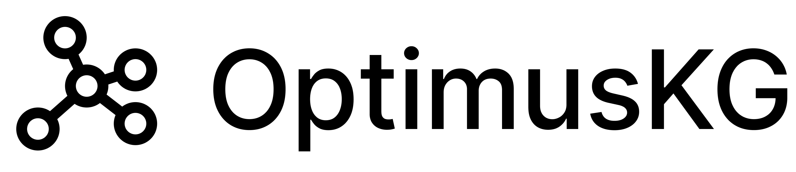

<p align="center">
  
</p>

[](https://github.com/astral-sh/uv)
[](https://opensource.org/licenses/MIT)
[](https://www.python.org/downloads/)
[](https://github.com/mims-harvard/OptimusKG)
[](https://doi.org/10.7910/DVN/IYNGEV)
[](https://github.com/pre-commit/pre-commit)
[](https://optimuskg.ai)

## Highlights

- A [modern biomedical knowledge graph](https://optimuskg.ai) with molecular, anatomical, clinical, and environmental modalities.
- Integrates 65 heterogeneous resources grounded with 18 ontologies and controlled vocabularies using the [BioCypher framework](https://github.com/biocypher/biocypher) and the [Biolink Model](https://github.com/biolink/biolink-model).
- Contains 190,531 nodes across 10 entity types, 21,813,816 edges across 26 relation types, and 67,249,863 property instances encoding 110,276,843 values across 150 distinct property keys.
- Independently validated using [PaperQA3](https://github.com/Future-House/paper-qa), a multimodal agent that retrieves and reasons over scientific literature.
- Reproducible, deterministic and infrastructure-agnostic data pipeline with parallel execution.
- Distributed as [Apache Parquet](https://parquet.apache.org/) files and downloadable via the [optimuskg]() python client.

OptimusKG is developed at the [Zitnik Lab](https://zitniklab.hms.harvard.edu/), [Harvard Medical School](https://dbmi.hms.harvard.edu/).

## Using OptimusKG

OptimusKG is available via [Harvard Dataverse](https://doi.org/10.7910/DVN/IYNGEV). The graph can be programmatically accessed using the Python client, available on [PyPI](https://pypi.org/project/optimuskg/):

```bash
# With pip.
pip install optimuskg
```

```bash
# Or pipx.
pipx install optimuskg
```

The client fetches files from the gold layer with local caching, and supports loading the graph either as [Polars Dataframes](https://github.com/pola-rs/polars) or as a [NetworkX MultiDiGraph](https://networkx.org/documentation/stable/reference/classes/multidigraph.html):

```python
import optimuskg

# Download (once) and cache a file from the gold layer
path = optimuskg.get_file("nodes/gene.parquet")

# Load a single Parquet file
drugs = optimuskg.load_parquet("nodes/drug.parquet")

# Load nodes and edges (full graph or Largest Connected Component)
nodes, edges = optimuskg.load_graph(lcc=True)

# Load as NetworkX MultiDiGraph (JSON properties parsed)
G = optimuskg.load_networkx(lcc=True)
```

> [!NOTE]
> Downloads are cached by default in `platformdirs.user_cache_dir("optimuskg")` (`~/Library/Caches/optimuskg` on macOS, `~/.cache/optimuskg` on Linux). The cache location can be overridden via the `$OPTIMUSKG_CACHE_DIR` environment variable or programmatically with `optimuskg.set_cache_dir(path)`.

> [!NOTE]
> To target a different dataset (_e.g._, a pre-release), set the `$OPTIMUSKG_DOI` environment variable or use `optimuskg.set_doi("doi:10.xxxx/XXXX")`.

## Data pipeline

The pipeline architecture consists of the following components:

| Component | Description |
| ---- | --- |
| [**catalog**](https://optimuskg.ai/the-catalog) | The single source of truth of all datasets, their schemas, their format, and their metadata. |
| [**dataset**](https://docs.kedro.org/en/unreleased/extend/how_to_create_a_custom_dataset/) | An abstraction that handles file formats, storage locations, and persistence logic. |
| [**node**](https://docs.kedro.org/en/unreleased/getting-started/kedro_concepts/#node) | A pure Python function whose output value follows solely from its input values. |
| [**pipeline**](https://docs.kedro.org/en/unreleased/getting-started/kedro_concepts/#pipeline) | A sequence of nodes wired into a DAG-based workflow, organized by the datasets they consume and produce. |
| [**layer**]() | Follows the medallion architecture data design pattern to logically organize the data. There are 4 layers: `landing`, `bronze`, `silver`, and `gold`.|
| [**parameters**](https://docs.kedro.org/en/unreleased/configure/parameters/) | Used to define constants for filtering the data across the construction process. |
| [**provider**]() | An abstraction that provides versioned, automatic data downloads from different data sources. |
| [**hook**](https://docs.kedro.org/en/unreleased/extend/hooks/introduction/) | Mechanism that allows injection of custom behavior into the core execution flow, such as before a node runs. |
| [**conf**]() | A mechanism that separates _code_ from _settings_, defining the catalog, parameters, logging configuration, and ontology harmonization across different environments. |

> [!NOTE]
> We leverage additional features of the [Kedro framework](https://github.com/kedro-org/kedro), such as [namespaces](https://docs.kedro.org/en/latest/build/namespaces/), [kedro-viz](https://docs.kedro.org/projects/kedro-viz/en/latest/), [kedro-datasets](https://docs.kedro.org/projects/kedro-datasets/en/latest/) and catalog injection in [Jupyter notebooks](https://docs.kedro.org/en/latest/integrations-and-plugins/notebooks_and_ipython/kedro_and_notebooks/#exploring-the-kedro-project-in-a-notebook).

## Running the pipeline

The pipeline is designed to generate the full knowledge graph and all the intermediate datasets used to generate it in one command:

```console
$ uv run kedro run --to-nodes gold.export_kg --runner=optimuskg.runners.FixedParallelRunner --async

[01/28/25 19:29:07] INFO     Using 'conf/logging.yml' as logging configuration. You can change this by setting the KEDRO_LOGGING_CONFIG environment variable accordingly.
[01/28/25 19:29:08] INFO     Kedro project optimuskg
[01/28/25 19:29:09] INFO     Using synchronous mode for loading and saving data. Use the --async flag for potential performance gains.
```

This will automatically download all the necessary data, store it in the `landing` layer, and execute the `bronze`, `silver`, and `gold` layers to finally export the graph inside the `data/gold/kg/` directory.

> [!NOTE]
> It is recommended to use the `optimuskg.runners.FixedParallelRunner`
> to run the nodes within a pipeline concurrently, and the [async](https://docs.kedro.org/en/latest/build/run_a_pipeline/#load-and-save-asynchronously) flag to reduce load and save time by using asynchronous mode. The Kedro default [ParallelRunner](https://docs.kedro.org/en/latest/build/run_a_pipeline/#parallelrunner) contains a bug that prevents it from running any validation checks.

> [!TIP]
> The location of each dataset, schema and their format is specified in the catalog.

> [!TIP]
> Run `make help` for a list of available Make commands, and `uv run cli --help` for additional CLI utilities.

> [!NOTE]
> The pipeline automatically downloads public datasets and ingests them in the `landing` layer. 
>
> Place any private datasets under `data/loading`. If absent, the [`Origin Hook`](https://github.com/mims-harvard/optimuskg/blob/main/optimuskg/hooks/origin/origin_hooks.py) will create empty placeholders, allowing dependent nodes to run even if the private data is missing.

Then, you can spin up a Neo4j database with the graph data simply by running:

```console
$ make neo4j

[+] Running 2/2
 ✔ Network optimuskg_default Created 
 ✔ Container neo4j           Started 
```

> [!NOTE]
> This will start a Neo4j container in the background. You can access the Neo4j Browser at [http://localhost:7474/browser/preview/](http://localhost:7474/browser/preview/).

## CLI Utilities

The pipeline ships a Typer-based CLI for common maintenance tasks. After installing dependencies you can run it with:

```console
uv run cli --help
```

### `sync-catalog` — Synchronize catalog schemas and checksums

For **ParquetDataset** entries the command reads the parquet file on disk and updates the YAML schema specification.
For any dataset with a `metadata.checksum` field it recomputes the BLAKE2b checksum and updates the catalog YAML (using regex replacement to preserve formatting, comments, and OmegaConf syntax).

```console
# Sync all schemas and checksums (landing, bronze, silver)
$ uv run cli sync-catalog

# Preview changes without writing files
$ uv run cli sync-catalog --dry-run

# Validate without updating (useful in CI)
$ uv run cli sync-catalog --validate

# Target a specific layer
$ uv run cli sync-catalog --layer bronze

# Target a specific dataset
$ uv run cli sync-catalog --dataset bronze.opentargets.disease
```

| Option | Short | Description |
| --- | --- | --- |
| `--layer` | `-l` | Target layer: `landing`, `bronze`, `silver`, or `all` (default: `all`). |
| `--dataset` | `-d` | Specific dataset name (e.g., `bronze.opentargets.disease`). |
| `--validate` | `-v` | Validate schemas and checksums without updating files. |
| `--dry-run` | `-n` | Preview changes without writing files. |
| `--catalog-dir` | | Path to the catalog directory (default: `conf/base/catalog`). |
| `--data-dir` | | Path to the data directory (default: `data`). |

## Citation

If you use OptimusKG in your research, please cite:

```bibtex
@article{vittor2026optimuskg,
  title={OptimusKG: Unifying biomedical knowledge in a modern multimodal graph},
  author={Vittor, Lucas and Noori, Ayush and Arango, I{\~n}aki and Polonuer, Joaqu{\'\i}n and Rodriques, Sam and White, Andrew and Clifton, David A. and Zitnik, Marinka},
  journal={Nature Scientific Data},
  year={2026}
}
```

## License

OptimusKG codebase is released under the [MIT License](LICENSE). OptimusKG integrates multiple primary data resources, each of which is subject to its own license and terms of use. These terms may impose restrictions on redistribution, commercial use, or downstream applications of the resulting knowledge graph or its subsets. Some resources provide data under academic or noncommercial licenses, while others may impose attribution or usage requirements. As a result, use of OptimusKG may be partially restricted depending on the specific data components included in a given instantiation. Users are responsible for reviewing and complying with the license and terms of use of each primary dataset, as specified by the original data providers. OptimusKG does not alter or override these source-specific licensing conditions.


<p align="center">
  Made with ❤️ at <a href="https://zitniklab.hms.harvard.edu/">Zitnik Lab</a>, Harvard Medical School
</p>
